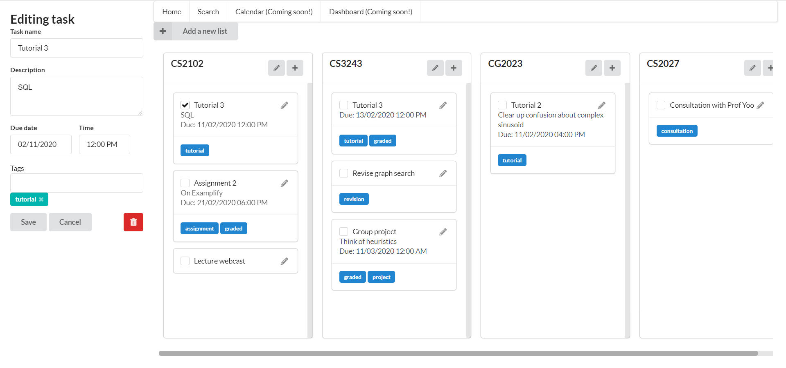

# README

## CVWO 2020 Assignment
Here is my task manager! It is currently a work in progress but here is a sneak peak:

It will be going online soon! So keep your eyes peeled :D

##### Name:
Cynthia Lee Weng Yan

##### Matriculation Number: 
A0190363H

* Ruby version

* System dependencies

* Configuration

* Database creation

* Database initialization

* How to run the test suite

* Services (job queues, cache servers, search engines, etc.)

* Deployment instructions

* ...
